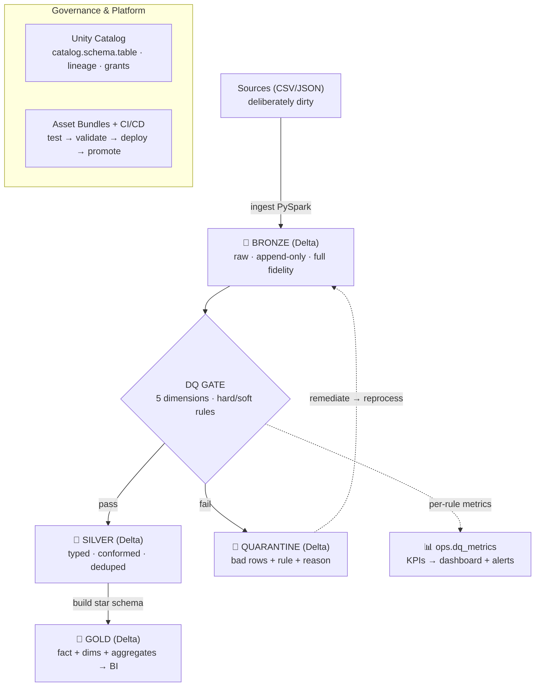

# 🍺 BrewQuality — a Medallion lakehouse with automated data-quality gates

A production-style **PySpark + Delta Lake** pipeline that treats data quality as
a first-class, tested, observable concern. Deliberately *dirty* sales/logistics
data lands in **bronze**; a **DQ gate** validates it across the five data-quality
dimensions and **quarantines** bad records with reasons; clean data builds a
**silver** model and a **gold** dimensional star schema — all orchestrated,
unit-tested in **CI**, and monitored with **DQ KPIs + alerting**.

> Built to mirror a real Data Quality Engineering stack: **Azure Databricks ·
> Delta Lake · Unity Catalog · Medallion · PySpark · Databricks Asset Bundles ·
> CI/CD · DQ dimensions & quarantine · observability/root-cause**. The
> engineering rigour (tests, IaC, CI gates, an incident runbook) is the point —
> data quality done the way you'd run a production system.

## Architecture



## The data-quality model

Rules are declarative `Rule` objects — *name · dimension · severity · boolean
expression* — so they read as documentation and unit-test trivially
([`brewquality/dq/rules.py`](brewquality/dq/rules.py)).

| Rule | Dimension | Severity | Catches |
|---|---|---|---|
| `completeness_customer_id` | completeness | error (quarantine) | null/blank customer |
| `completeness_order_amount` | completeness | error | missing/garbage amount |
| `validity_quantity_positive` | validity | error | quantity ≤ 0 / non-numeric |
| `validity_order_date` | validity | error | unparseable date (`2025-13-40`) |
| `uniqueness_order_id` | uniqueness | error | duplicate `order_id` (keeps 1st) |
| `integrity_product_id` | integrity | error | product not in dimension |
| `integrity_customer_id` | integrity | error | customer not in dimension |
| `accuracy_amount_matches` | accuracy | **warn** (soft) | amount ≠ qty × price |

**Hard rules** quarantine the row; **soft rules** let it pass but flag + count it
(alert on spikes) — so pipelines don't halt on benign anomalies. See
[ADR-0004](docs/adr/0004-hard-vs-soft-rules.md).

## Quick start

```bash
pip install -r requirements.txt

# 1) generate deliberately-dirty data   2) run the lakehouse   3) see DQ KPIs
python -m brewquality.generate_data --orders 5000 --seed 42
python -m brewquality.pipeline --reset
python -m brewquality.dq_report
pytest                                      # unit-test transforms + every rule
```

`pipeline.py` runs **raw → bronze → (DQ gate) → silver → gold**. Bad rows land in
`data/lake/quarantine/orders` with their failed rule + reason; per-rule KPIs
accumulate in `data/lake/ops/dq_metrics`. The authoritative run is
[CI](.github/workflows/ci.yml) (Linux) and Databricks — both run clean with no
native setup.

> **Running on Windows?** Spark's local filesystem needs Hadoop native bits
> (`winutils.exe` + a matching `hadoop.dll`) on `HADOOP_HOME`, plus the MSVC++
> runtime — Delta *reads* call `NativeIO`. Run `scripts/setup_hadoop_win.ps1`,
> set `HADOOP_HOME`, and use a `hadoop.dll` matching the bundled Hadoop version.
> WSL2 / Linux / macOS need none of this. PySpark 3.5 on Python 3.12 also needs
> `setuptools` for the `distutils` shim (already in `requirements.txt`).

## Project phases (each is independently demo-able)

| Phase | What it adds | Where |
|---|---|---|
| **1 · Medallion** | PySpark + Delta bronze→silver→gold, star schema | [`brewquality/`](brewquality/) |
| **2 · DQ + quarantine** | 5 dimensions, hard/soft rules, metrics | [`brewquality/dq/`](brewquality/dq/) |
| **3 · Databricks + UC** | notebooks, Unity Catalog, Workflows | [`databricks/`](databricks/) |
| **4 · CI/CD** | pytest + GitHub Actions DQ gate, Asset Bundles | [`.github/`](.github/workflows/ci.yml), [`databricks.yml`](databricks/databricks.yml) |
| **5 · Observability** | DQ KPI report, alerting, incident runbook | [`dq_report.py`](brewquality/dq_report.py), [`runbook`](docs/runbook-data-incident.md) |
| **6 · Azure** | Key Vault, SP/Managed Identity, ADLS Gen2 | [`docs/azure-setup.md`](docs/azure-setup.md) |

## What makes this senior, not just "asserts on a DataFrame"

- **Quarantine, not silent drops** — every bad row is auditable & remediable
  ([ADR-0003](docs/adr/0003-quarantine-not-drop.md)).
- **DQ rules as tested artifacts** — [`tests/test_dq_rules.py`](tests/test_dq_rules.py)
  proves each dimension's rule fires on its defect.
- **Shift-left DQ gate in CI** — the build *fails* if quality drifts out of bounds
  ([`ci_audit.py`](brewquality/ci_audit.py)), i.e. Write-Audit-Publish.
- **Incident runbook** — SRE detect→contain→root-cause→fix→prevent applied to a
  data incident ([runbook](docs/runbook-data-incident.md)).
- **ADRs** — the architectural trade-offs written down ([`docs/adr/`](docs/adr/)).
- **Portable core** — the same `brewquality.dq` engine runs locally, in CI, and
  in the Databricks notebooks (UC tables) unchanged.

## Tech & design notes

- **Delta everywhere** for ACID, schema enforcement, time travel (incident
  diff/restore) and `MERGE`; Delta `CHECK`/`NOT NULL` constraints as a backstop
  ([ADR-0005](docs/adr/0005-delta-lake-storage.md)).
- **Hand-rolled DQ engine** over a framework for transparency + testability, with
  a clean migration path to **DQX / Great Expectations / Ataccama**
  ([ADR-0002](docs/adr/0002-dq-engine-vs-framework.md)).
- **Unity Catalog** for the three-level namespace, lineage (root-cause) and
  least-privilege grants; **Asset Bundles** as IaC for Databricks.

## Layout

```
brewquality/        bronze · silver · gold · pipeline · dq_report · ci_audit
  dq/               rules · engine · prepare   (the portable DQ core)
databricks/         databricks.yml (DAB) · notebooks (UC) · deploy README
docs/               adr/ · runbook-data-incident.md · azure-setup.md
tests/              transforms + every DQ rule
.github/workflows/  ci.yml (tests + pipeline + DQ audit gate)
```
